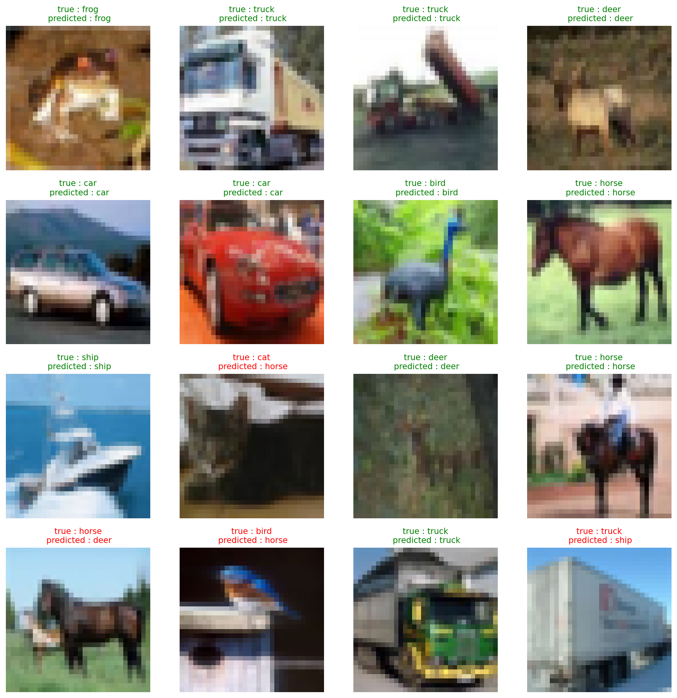

# CIFAR-10 Image Classifier

A CNN built from scratch using PyTorch to classify 32×32 images into 10 categories.

## Results

**Test Accuracy:** 75.27%



## Architecture

```
Input (32×32×3)
  ↓
Conv1 (3→16 channels) + ReLU + MaxPool
  ↓
Conv2 (16→32 channels) + ReLU + MaxPool
  ↓
Flatten (2048 features)
  ↓
FC1 (2048→128) + ReLU
  ↓
FC2 (128→10 classes)
```

**Total Parameters:** 268,650

## Training

- **Optimizer:** Adam (lr=0.001)
- **Loss:** CrossEntropyLoss
- **Epochs:** 5
- **Batch Size:** 64
- **Device:** CUDA (GPU)

## Tech Stack

PyTorch • CUDA • torchvision • matplotlib

---

Built as part of learning CNNs and neural network fundamentals from scratch! 🧠
