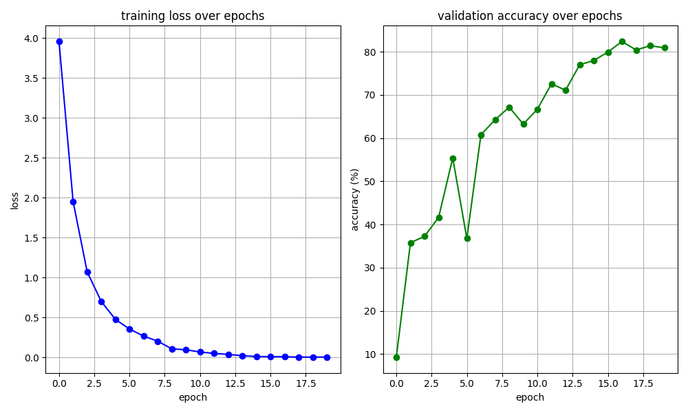
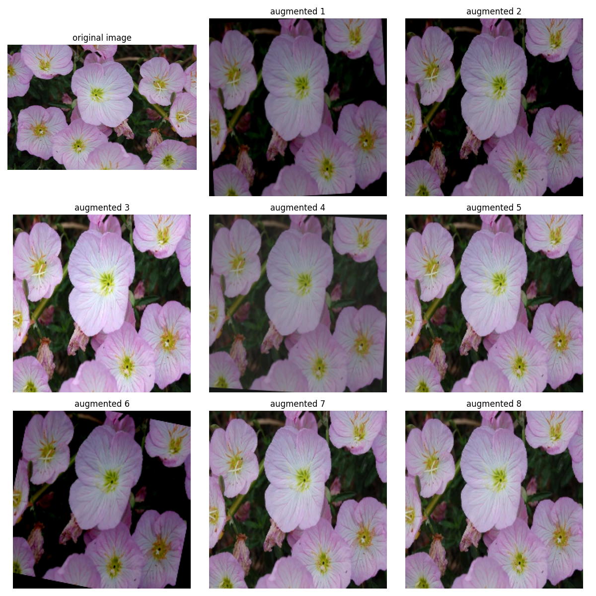

# ResNet Flowers-102 Classifier

A ResNet18-based classifier using transfer learning to identify 102 flower species. Implements class imbalance handling, data augmentation, mixed precision training, and early stopping for production-ready performance.

**🚀 [Try Live Demo](https://resnetflagship-8jatnx6d22xdntk63jmapx.streamlit.app/)**

## Results

**Test Accuracy:** 81.49% (on controlled test set)

**⚠️ Real-World Performance Note:**  
The model performs well on images similar to the training distribution (Oxford Flowers-102 dataset) but struggles with real-world photos that have different lighting, angles, or backgrounds. This gap between test accuracy and real-world performance is a common challenge in production ML systems.





## Model Architecture

**Base Model:** ResNet18 (pre-trained on ImageNet)

- Uses pre-trained convolutional layers as feature extractor
- Modified final fully-connected layer: 512 → 102 classes

```
ResNet18 (Pre-trained)
  ↓
[Conv Layers - FROZEN]
  ↓
Adaptive Avg Pool
  ↓
FC Layer (512 → 102 classes) - TRAINABLE
  ↓
Output (102 flower species)
```

**Total Parameters:** ~11M  
**Trainable Parameters:** ~52K (final layer only)

## Dataset

- **Source:** Flowers-102 (Oxford)
- **Classes:** 102 flower species
- **Total Images:** ~8,000
- **Split:** Train 1,020 / Val 204 / Test 6,149
- **Image Size:** 224×224 (ResNet standard)

## Training Configuration

- **Optimizer:** AdamW (lr=0.001, weight_decay=0.01)
- **Loss Function:** CrossEntropyLoss (with class weights)
- **Epochs:** 20 (early stopped at 17)
- **Batch Size:** 32
- **Device:** CUDA (GPU)
- **Data Augmentation:** Albumentations (flips, rotations, color jitter, brightness)
- **Mixed Precision:** torch.amp (33% faster training)

## Performance

| Metric           | Value                          |
| ---------------- | ------------------------------ |
| Test Accuracy    | 81.49%                         |
| Training Time    | ~2 mins (17 epochs, GPU)       |
| Baseline (no CW) | 0.49% → 81% with class weights |

## Tech Stack

**Training:** PyTorch • torchvision • CUDA • ResNet18 • Transfer Learning • Albumentations • Mixed Precision  
**Deployment:** Streamlit • Streamlit Cloud • Pillow

---

Built as part of learning production ML practices and class imbalance handling! 🌸
