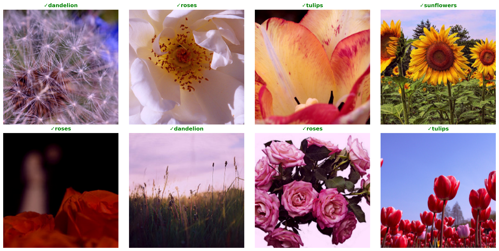

# Transfer Learning Flower Classifier

A ResNet18-based classifier using transfer learning to identify 5 flower species. Leverages ImageNet pre-trained weights for faster training and better accuracy.

## Results

**Test Accuracy:** 84.20%




## Model Architecture

**Base Model:** ResNet18 (pre-trained on ImageNet)

- Uses pre-trained convolutional layers as feature extractor
- Modified final fully-connected layer: 512 → 5 classes

```
ResNet18 (Pre-trained)
  ↓
[Conv Layers - FROZEN]
  ↓
Adaptive Avg Pool
  ↓
FC Layer (512 → 5 classes) - TRAINABLE
  ↓
Output (5 flower classes)
```

**Total Parameters:** ~11M  
**Trainable Parameters:** ~2,500 (final layer only)

## Dataset

- **Source:** TensorFlow Flower Photos
- **Classes:** Daisy, Dandelion, Roses, Sunflowers, Tulips
- **Total Images:** 3,670
- **Split:** 80% train (2,944), 20% test (726)
- **Image Size:** 224×224 (ResNet standard)

## Training Configuration

- **Optimizer:** Adam (lr=0.001)
- **Loss Function:** CrossEntropyLoss
- **Epochs:** 10
- **Batch Size:** 32
- **Device:** CUDA (GPU)
- **Data Augmentation:** ImageNet normalization

## Performance

| Metric        | Value                      |
| ------------- | -------------------------- |
| Test Accuracy | 84.20%                     |
| Training Time | ~5 mins (10 epochs on GPU) |
| Final Loss    | 0.11                       |

## Tech Stack

PyTorch • torchvision • CUDA • ResNet18 • Transfer Learning • argparse • matplotlib

---

Built as part of learning transfer learning and production ML practices! 🌸
